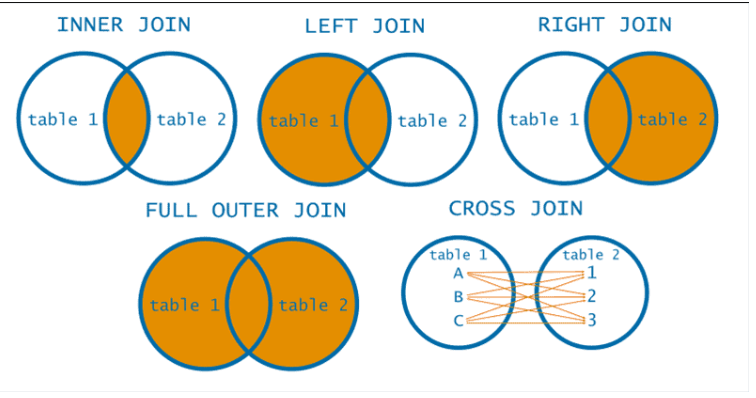

## DQL 4.

## Többtáblás lekérdezések

A való életben nagyon ritka, hogy az adataink egyetlen táblában megtalálhatóak. Ezért szükséges, hogy több táblát együtt kezeljünk. Erre szolgál a **JOIN** utasítás. A JOIN minden esetben csak két táblát köt össze. Ha kettőnél több táblát szeretnénk összekötni akkor azt mindig további JOIN-okkal oldjuk meg. A JOIN-okat több csoportba soroljuk.

A **CROSS JOIN** két tábla Descartes szorzatát adja vissza, tehát egy tábla minden rekordjához hozzárendeli egy másik tábla minden rekordját. Kifejezetten veszélyes a használata mivel hatalmas adatmennyiséget állít elő. Ha A táblánkban van 100 rekord és B táblánkban is van 100 rekord akkor a CROSS JOIN egy 10 000 rekordos táblát fog előállítani. Ha ilyesmire van szükség akkor például WHERE feltételekkel tudjuk korlátozni a létrejövő kombinációk számát. Általában ugyanis nem csak 100 rekordunk van egy táblázatban.

A következő JOIN típusokat viszont már kisebb nagyobb gyakorisággal, de mégis lényegesen többször használjuk mint a CROSS JOIN-t az alábbi kis ábra jól szemlélteti a különbséget.  

  

Az **INNER JOIN** két táblázat metszetét adja vissza, tehát csak azokat az elemeket, amelyek mindkét táblázatban megtalálhatóak a kapcsolómező alapján. Az alábbi példában a legkérdezésünk csak azokat a termékkategóriákat adja vissza, amelyeknek vannak alkategóriái is.
```sql
SELECT PC.ProductCategoryID, PC.Name 'Category Name', PSC.Name 'subcategory name'
FROM Production.productcategory PC INNER JOIN  Production.productsubcategory PSC ON PC.ProductCategoryID=PSC.ProductCategoryID
```  
Az **OUTER JOIN** egy kategória, amely három lehetőséget is tartalmaz. Az a közös bennük, hogy a metszeten túl tartalmazza egyik vagy másik vagy mindkét tábla olyan elemeit is, amihez nem tartozik a feltételnek megfelelő rekord a másik táblából. Fontos hogy ellentétben a CROSS JOIN-al itt sem történik hozzárendelés csak egymáshoz rendezés.  

A **LEFT JOIN** a bal oldali tábla összes elemét tartalmazza és hozzárendezi a jobb oldali tábla a megadott feltételnek megfelelő mezőit. A jobb és baloldali tábla megnevezés megértéséhez egy kis logikai magyarázat. JOIN esetében a FROM rész a következőképpen nézne ki egy sorba írva.  
**FROM** baloldali tábla **LEFT JOIN** jobb oldali tábla **ON** kapcsolómező.  
Egy példa a LEFT JOIN-ra:  
```sql
SELECT P.Name Productname, PS.Name 'Subcategory Name'
FROM Production.product P LEFT JOIN Production.productsubcategory PS ON P.ProductSubcategoryID=PS.ProductSubcategoryID
```
A **RIGHT JOIN** a LEFT JOIN “tükörképe”. Ebben az esetben a jobboldali tábla minden elemét fogja tartalmazni és a kapcsolómező alapján hozzáfűzi a bal oldali tábla rekordjait.
A fenti példa RIGHT JOIN-al.
```sql
SELECT P.Name Productname, PS.Name 'Subcategory Name'
FROM Production.product P RIGHT JOIN Production.productsubcategory PS ON P.ProductSubcategoryID=PS.ProductSubcategoryID
```  

A **FULL JOIN** az utolsó variáció. Ebben az esetben a két táblázat minden rekordját tartalmazni fogja a legkérdezésünk és a kapccsolómező alapján a összefűzi azokat a rekordokat, amik mindkét táblázatban megtalálhatóak.
A korábbi példa FULL JOIN-al.
```sql
	SELECT P.Name Productname, PS.Name 'Subcategory Name'
		FROM Production.Product P FULL JOIN Production.ProductSubcategory PS ON P.ProductSubcategoryID=PS.ProductSubcategoryID
 ```
A megfelelő JOIN kiválasztása egy-egy lekérdezésben nagyon fontos mivel látható, hogy eltérő eredményeket ad vissza az esetek többségében. Előfordulhat olyan eset, amikor akár mind a 4 JOIN ugyanazt az erdeményt adja vissza. Az OUTER JOIN-os példáknál maradva ha mindkét táblában csak ugyanazok a ProductID-k szerepelnek akkor egyik táblában sem lesz olyan rekord amihez ne lehetne hozzáfűzni a másik tábla egy rekordját mivel a kapcsolómező szempontjából a két tábla külön külön is megegyezik a két tábla metszetével. Ugyanakkor ettől még a lekérdezésnél a megfelelő JOIN variációt kell használni, hisz az adatok változhatnak. Persze mondhatjuk, hogy a ProductID-t kötelező mezővé tesszük, de ez is módosítható a lekérdezésünktől függetlenül és akkor már helytelen eredményt kapunk. 

--- 
# Tábla kapcsolat join nélkül - inner join helyett  

```sql
-- inner join nélkül ugyanaz a táblakapcsolás
SELECT SOH.SalesOrderID, SOH.DueDate, SOH.TotalDue, c.FirstName
FROM Sales.salesorderheader SOH, contact c
WHERE SOH.ContactID = c.ContactID;
-- c.MiddleName IS NULL;
```
